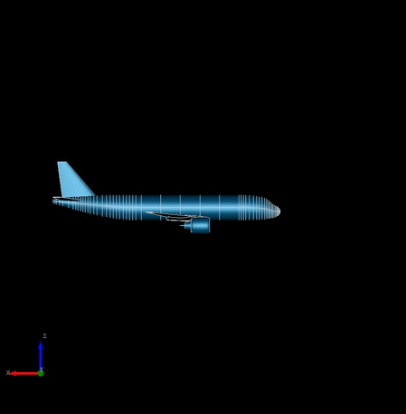

Title: Parametric modeling of engine nacelles and pylons
Date: 2019-05-27 15:33
Category: News
Author: Jan Kleinert

Parametric modeling of engine nacelles and pylons are now possible with TiGL 3.0.  Blablabla

Some more blabla, don't forget to talk about pylons etc.