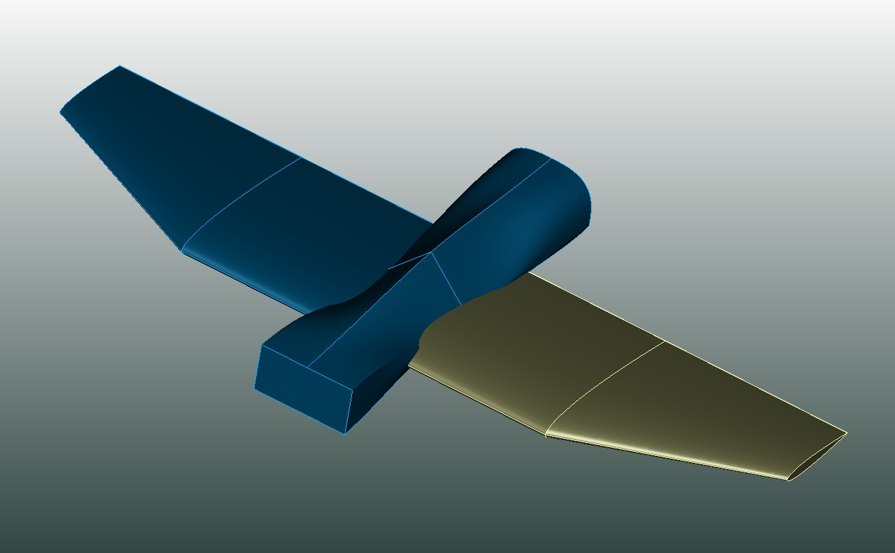
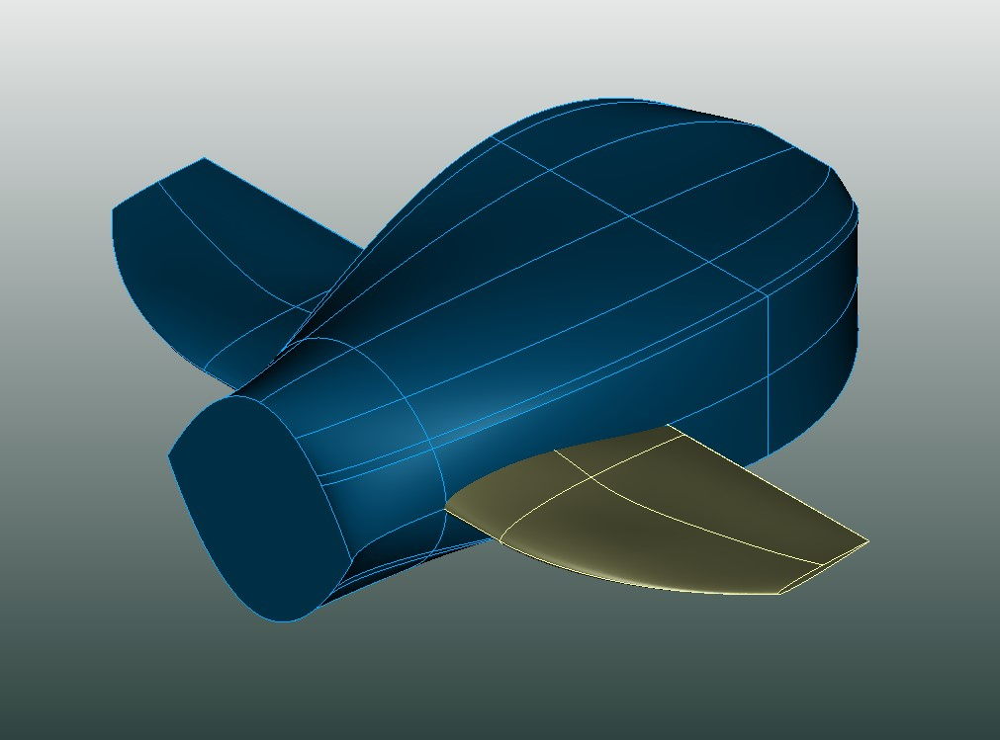
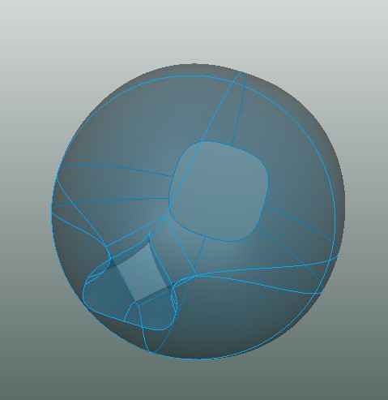

Title: TiGL 3.4.0 released
Date: 2024-11-12 15:30
Category: News
Author: Meike Kobold

We are happy to announce the release of TiGL 3.4.0.

The new release features:

   - Updated TiGL to CPACS 3.4
   - Added ability to read CPACS 3.5 (while raising a warning that CPACS version is newer than supported version)

   - Implementation of standard fuselage profiles, i.e. rounded rectangle profiles and superellipses
   :

    

			
	

    

			
	

    

			
	

   - Guide curves can now optionally be prescribed using `fromParameter ` and `toParameter` instead of `fromRelativeCircumference` and `toRelativeCircumference`. For futher details see [documentation](https://dlr-sl.github.io/cpacs-website/pages/documentation.html) on guide curves.
  
   - Bugfixes

   The complete changelog can be seen at our [TiGL 3.4.0 release page.](https://github.com/DLR-SC/tigl/releases/tag/v3.4.0)