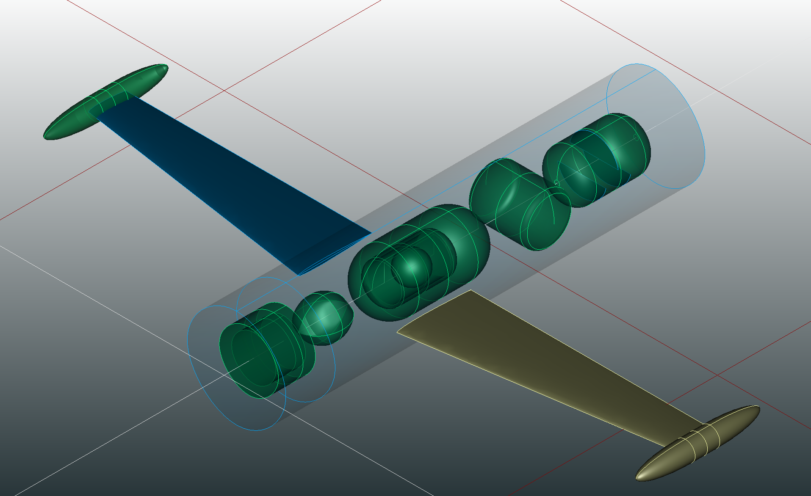

Title: TiGL 3.4.1 Released
Date: 2025-09-08 18:18
Category: News
Author: Jan Kleinert

We have just release TiGL 3.4.1.

### What's new

 - The new release includes an implementation of LH2 tanks *(Thanks Marko Alder for the great work)*. 
  - Releases are distributed with OpenCascade Technologies (OCCT) 7.6.2 and TiXI 3.3.1
  - We now use the C++17 standard
  - New API function `tiglComponentTransformPointToGlobal`
  - And many small improvements and bug fixes.

The complete changelog can be seen at our [TiGL 3.4.1 release page.](https://github.com/DLR-SC/tigl/releases/tag/v3.4.1)

**Enjoy!** The next release is just around the corner.
