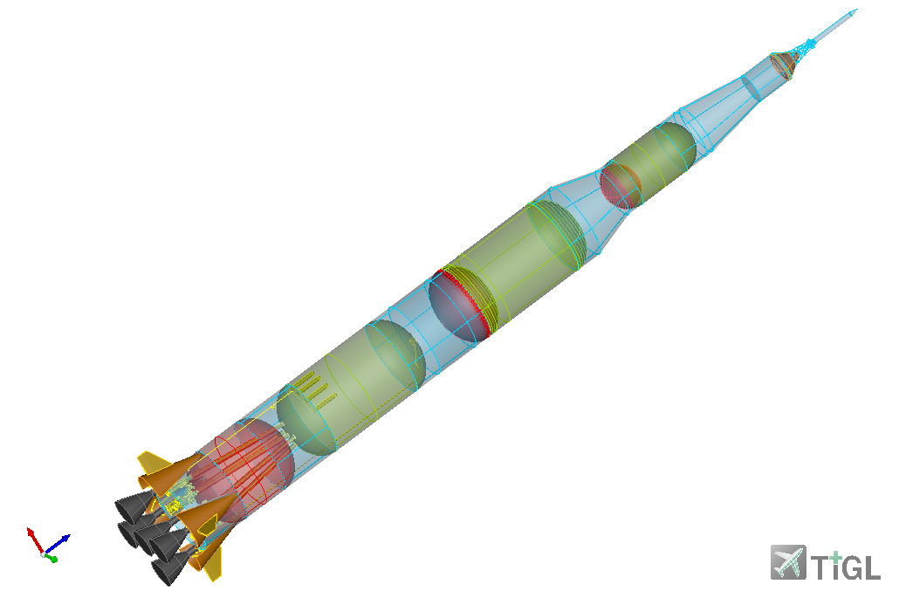

Title: TiGL 3.5.0 Released
Date: 2026-09-04 10:28
Category: News
Author: Sven Goldberg

We are happy to announce that we just released TiGL 3.5.0.

<video controls playsinline autoplay muted style="max-width: 100%; height: auto;">
  <source src="videos/TiGLCreator_3_5_0.mp4" type="video/mp4">
</video>

    

			
	

### What's new
  - Full integration of the pre-released creator functionality
    - Add/Delete/Modify CPACS fuselages and wings directly in the GUI via high level parameters and save the changes
    - CPACS Tree to show file structure
    - Display options to modify rendering of each component
    - Undo/Redo options
    - ... many more ...
  - Support the [latest CPACS 3.5.1](https://dlr-sl.github.io/cpacs-website/cpacs-v351-published.html) (e.g. systems definition)
  - Support NACA4 profile natively by passing parameters
  - Introduce leading edge devices
  - Support approximation of profile/airfoil point lists to be more efficient
  - Support ducts in fuel tank vessels
  - Modify grid resolution
  - Add user-defined spotlights
  - Display control point net of a component's face
  - And many other small improvements and bug fixes

The complete changelog can be seen at our [TiGL 3.5.0 release page.](https://github.com/DLR-SC/tigl/releases/tag/v3.5.0)

**Enjoy!**
